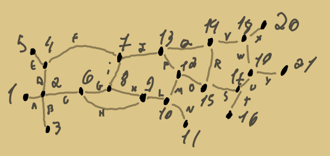
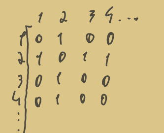

# Estrutura de dados

Os modelos de estrutura de dados são formas que os computadores usam para armazenar os dados, sejam eles de formas primitivas -como o armazenamento de valores inteiros, booleanos, strings e etc.- como também de formas mais abstratas -como árvores, grafos, listas, pilhas e etc.

## Qual a usabilidade?

O estudo das estruturas de dados tem aplicacões diretas nos algoritmos, tais como algoritmos de GPS, otimizacão de processos, manuseio de grandes quantidades de dados e etc.

Na prática, estrutura de dados estão em todos os lugares, até mesmo, como falado anteriormente, na busca de caminhos por GPS. Porém, o computador não armazena informacões do mesmo jeito que nossa mente. Vamos levar em consideracão o seguinte cenário.

### Exemplo de um grafo

Para uma melhor visualizacão, podemos nos apropriar de uma área matemática inspirada inicialmente por Euler chamada teoria dos grafos (por isso que grafo também é um tipo de estrutura de dados), nisso podemos atribuir nós e arcos para representar a figura. Podemos identificar os nós por números. E os arcos por letras:

Ainda sim, para um computador esse tipo de representacão fica inviável. Mas, há várias formas matemáticas de representar esse tipo de estrutura e uma delas é através de matrizes. Como exemplo uma matriz de adjacência.

Nesse tipo de matriz, podemos identificar os nós vizinhos. E para algoritmos isso é de extrema importância, como exemplo os algoritmos de busca em grafos: Dijkstra, A*, Bellman Ford...